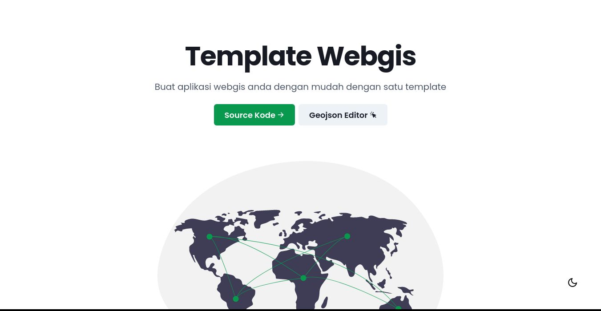

# WEBGIS TEMPLATE

template webgis adalah template aplikasi untuk anda yang ingin membuat sistem berbasis geospasial menggunakan framework Reactjs dan Leaflet Maps

## Fitur

- Template stuktur folder untuk development
- Landing Page
- Dinamis peta dengan tiga konsep visual :
  - layer
  - basemap
  - legenda
- GeoJSON editor untuk mencoba coba membuat dan mengupload peta

## Bahasa, Framework dan Library yang digunakan

- Typescript + React
- Leaflet + React Leaflet
- Chakra UI

## Folder Guide

bisa dicek [`disini`](./FOLDER-GUIDE.md)

## Panduan Berkontribusi

- fork, lalu clone repository ini
- buat branch dari repomu berdasarkan fitur atau bug, misal fitur `repl` maka buat `repl-feature` atau `bug` maka `repl-bug`
- buat pull request ke repository owner dan tunggu balasanya

## Lisensi

MIT.
